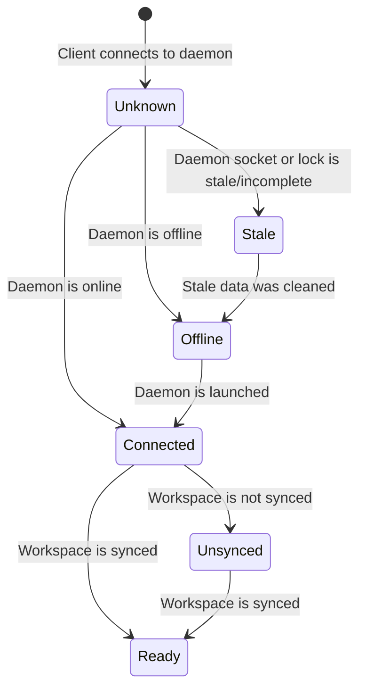

```mermaid
stateDiagram-v2
    [*] --> Unknown : Client connects to daemon
    Unknown --> Offline : Daemon is offline
    Unknown --> Stale : Daemon socket or lock is stale/incomplete
    Unknown --> Connected : Daemon is online
    Connected --> Unsynced : Workspace is not synced
    Connected --> Ready : Workspace is synced
    Unsynced --> Ready : Workspace is synced
    Offline --> Connected : Daemon is launched
    Stale --> Offline : Stale data was cleaned
```