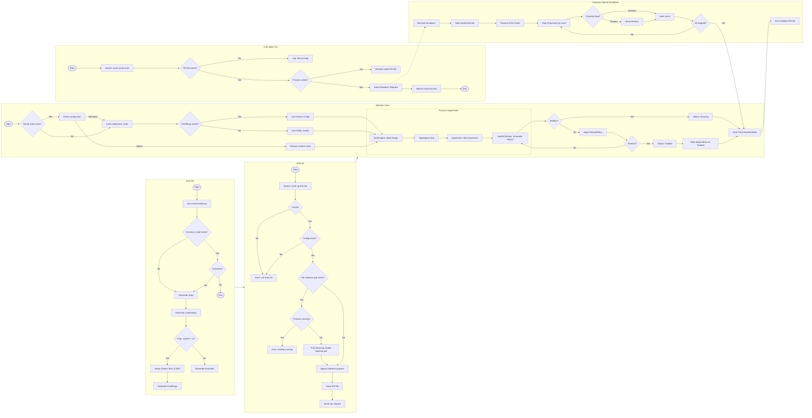

```mermaid
flowchart LR
    %% Subgraph: INIT
    subgraph INIT["knot init"]
        direction TB
        INIT_Start([Start]) --> INIT_GetDir[Get current directory]
        INIT_GetDir --> INIT_CheckExists{Directory .knot/ exists?}
        
        INIT_CheckExists -- Yes --> INIT_Confirm{Overwrite?}
        INIT_CheckExists -- No --> INIT_CreateDir[Generate .knot/]
        
        INIT_Confirm -- Yes --> INIT_CreateDir
        INIT_Confirm -- No --> INIT_End([End])
        
        INIT_CreateDir --> INIT_CreateHooks[Generate .knot/hooks/]
        INIT_CreateHooks --> INIT_CheckPy{Flag --python / -p?}
        
        INIT_CheckPy -- Yes --> INIT_PySetup[Setup Python Venv & SDK]
        INIT_PySetup --> INIT_GenPyFile[Generate Knotfile.py]
        
        INIT_CheckPy -- No --> INIT_GenToml[Generate Knot.toml]
    end

    %% Subgraph: UP
    subgraph UP["knot up"]
        direction TB
        UP_Start([Start]) --> UP_FindRoot[Search .knot/ up the tree]
        UP_FindRoot --> UP_Found{Found?}
        
        UP_Found -- No --> UP_ErrInit[Error: run knot init]
        UP_Found -- Yes --> UP_CheckConf{Config exists?}
        
        UP_CheckConf -- No --> UP_ErrInit
        UP_CheckConf -- Yes --> UP_CheckPID{File 'daemon.pid' exists?}
        
        UP_CheckPID -- Yes --> UP_CheckProc{Process running?}
        UP_CheckPID -- No --> UP_Spawn[Spawn Daemon process]
        
        UP_CheckProc -- Yes --> UP_ErrRun[Error: already running]
        UP_CheckProc -- No --> UP_Rewrite[Print Warning; Delete 'daemon.pid']
        
        UP_Rewrite --> UP_Spawn
        UP_Spawn --> UP_CreatePID[Save PID file]
        UP_CreatePID --> UP_SendUp[Send 'Up' request]
    end

    %% Subgraph: DOWN
    subgraph DOWN["knot down CLI"]
        direction TB
        DOWN_Start([Start]) --> DOWN_FindRoot[Search .knot/ up the tree]
        DOWN_FindRoot --> DOWN_CheckPID{PID file exists?}
        
        DOWN_CheckPID -- No --> DOWN_NotRunning[Log: Not running]
        DOWN_CheckPID -- Yes --> DOWN_CheckProc{Process active?}
        
        DOWN_CheckProc -- No --> DOWN_CleanupPID[Remove stale PID file]
        DOWN_CheckProc -- Yes --> DOWN_Signal[Send Shutdown Request]
        
        DOWN_Signal --> DOWN_Wait[Wait for Daemon Exit]
        DOWN_Wait --> DOWN_End([End])
    end

    %% Subgraph: DAEMON
    subgraph DAEMON["Daemon Core"]
        direction TB
        D_Start([Start]) --> D_CheckState{Saved state exists?}
        
        D_CheckState -- Yes --> D_Validate[Check config hash]
        D_Validate -- Match --> D_Restore[Restore runtime state]
        D_Validate -- Mismatch --> D_LoadNew[Load config from .knot/]
        
        D_CheckState -- No --> D_LoadNew
        
        D_LoadNew --> D_Priority{Knotfile.py exists?}
        D_Priority -- Yes --> D_UsePy[Use Python Config]
        D_Priority -- No --> D_UseToml[Use TOML Config]
        
        D_UsePy --> D_Engine[DAGEngine: Build Graph]
        D_UseToml --> D_Engine
        D_Restore --> D_Engine

        subgraph ORCHESTRATION["Process Supervision"]
            D_Engine --> D_TopoSort[Topological Sort]
            D_TopoSort --> D_SpawnProc[Supervisor: Start processes]
            D_SpawnProc --> D_Health[HealthChecker: Schedule checks]
        end

        D_Health --> D_HealthRes{Healthy?}
        D_HealthRes -- Yes --> D_Running[Status: Running]
        D_HealthRes -- No --> D_Retry[Apply RestartPolicy]
        
        D_Retry --> D_Timeout{Timeout?}
        D_Timeout -- No --> D_Health
        D_Timeout -- Yes --> D_Fault[Status: Faulted]
        
        D_Fault --> D_Propagate[Mark dependents as Faulted]
        D_Running --> D_SaveState[Update RuntimeStateStore]
        D_Propagate --> D_SaveState
    end

    %% Subgraph: DAEMON_DOWN
    subgraph DAEMON_SHUTDOWN["Daemon Internal Shutdown"]
        direction TB
        D_Recv[Receive Shutdown] --> D_StopHealth[Stop HealthChecker]
        D_StopHealth --> D_RevDAG[Reverse DAG Order]
        
        D_RevDAG --> D_StopLevel[Stop Processes by Level]
        D_StopLevel --> D_CheckGrace{Graceful Stop?}
        
        D_CheckGrace -- Timeout --> D_Kill[Send SIGKILL]
        D_CheckGrace -- Success --> D_NextLevel[Next Level]
        D_Kill --> D_NextLevel
        
        D_NextLevel --> D_AllStopped{All stopped?}
        D_AllStopped -- No --> D_StopLevel
        
        D_AllStopped -- Yes --> D_SaveState[Save Final RuntimeState]
        D_SaveState --> D_Exit[Exit & Delete PID file]
    end

    DOWN_Signal -.-> D_Recv
    INIT --> UP
    UP --> DAEMON
```