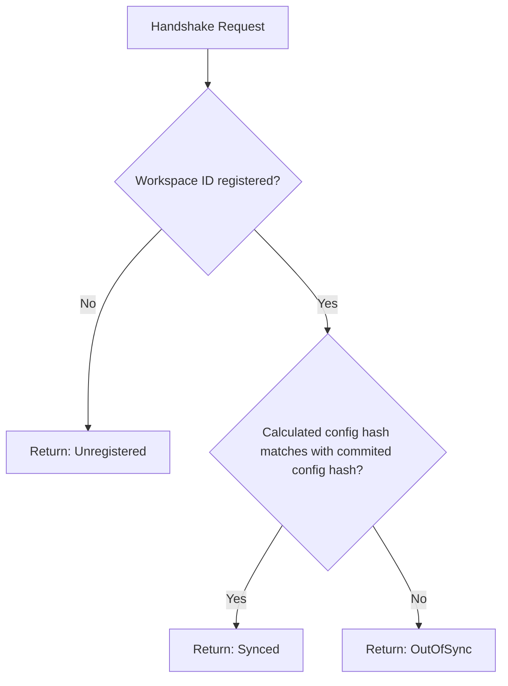

```mermaid
flowchart TD
    A[Handshake Request] --> B{Workspace ID registered?}
    B -->|No| C[Return: Unregistered]
    B -->|Yes| D{Calculated config hash matches with commited config hash?}
    D -->|Yes| E[Return: Synced]
    D -->|No| F[Return: OutOfSync]
```