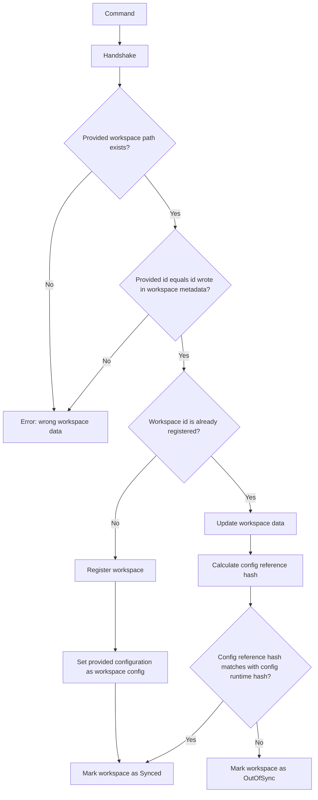

```mermaid
flowchart TD
    A[Command] --> B[Handshake]
    B --> F{Provided workspace path exists?}
    F -->|Yes| C{Provided id equals id wrote in workspace metadata?}
    F -->|No| D[Error: wrong workspace data]
    C -->|No| D
    C -->|Yes| E{Workspace id is already registered?}
    E -->|Yes| J[Update workspace data]
    E -->|No| G[Register workspace]
    G --> V[Set provided configuration as workspace config]
    V --> K[Mark workspace as Synced]
    H -->|Yes| K
    J --> L[Calculate config reference hash]
    L --> H{Config reference hash matches with config runtime hash?}
    H -->|No| I[Mark workspace as OutOfSync]
```