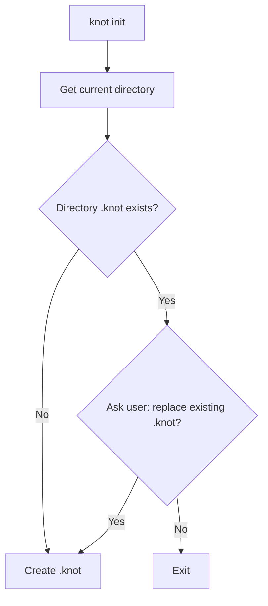

```mermaid
flowchart TD
    A[knot init] --> B[Get current directory]
    B --> C{Directory .knot exists?}
    C -->|Yes| D{Ask user: replace existing .knot?}
    C -->|No| E[Create .knot]
    D -->|Yes| E
    D -->|No| F[Exit]
```