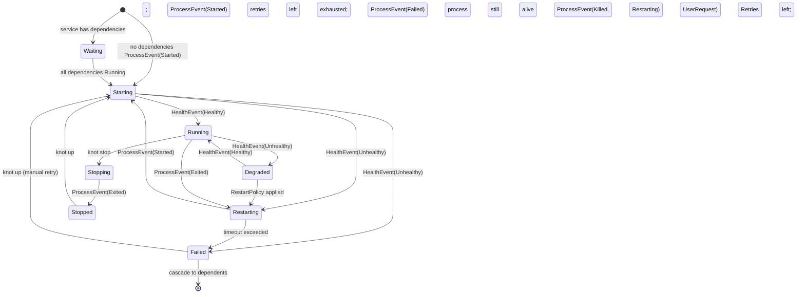

```mermaid

stateDiagram-v2
    [*] --> Waiting : service has dependencies

    [*] --> Starting : no dependencies ProcessEvent(Started)

    Waiting --> Starting : all dependencies Running; ProcessEvent(Started)

    Starting --> Running : HealthEvent(Healthy)

    Starting --> Restarting : HealthEvent(Unhealthy); retries left

    Starting --> Failed : HealthEvent(Unhealthy); retries exhausted; ProcessEvent(Failed)

    Restarting --> Starting : ProcessEvent(Started)

    Restarting --> Failed : timeout exceeded; ProcessEvent(Failed)

    Running --> Degraded : HealthEvent(Unhealthy); process still alive

    Degraded --> Running : HealthEvent(Healthy)

    Degraded --> Restarting : RestartPolicy applied; ProcessEvent(Killed, Restarting)

    Running --> Stopping : knot stop; ProcessEvent(Killed, UserRequest)

    Running --> Restarting : ProcessEvent(Exited); Retries left; ProcessEvent(Killed, Restarting)

    Stopping --> Stopped : ProcessEvent(Exited)

    Stopped --> Starting : knot up; ProcessEvent(Started)

    Failed --> Starting : knot up (manual retry); ProcessEvent(Started)

    Failed --> [*] : cascade to dependents

```