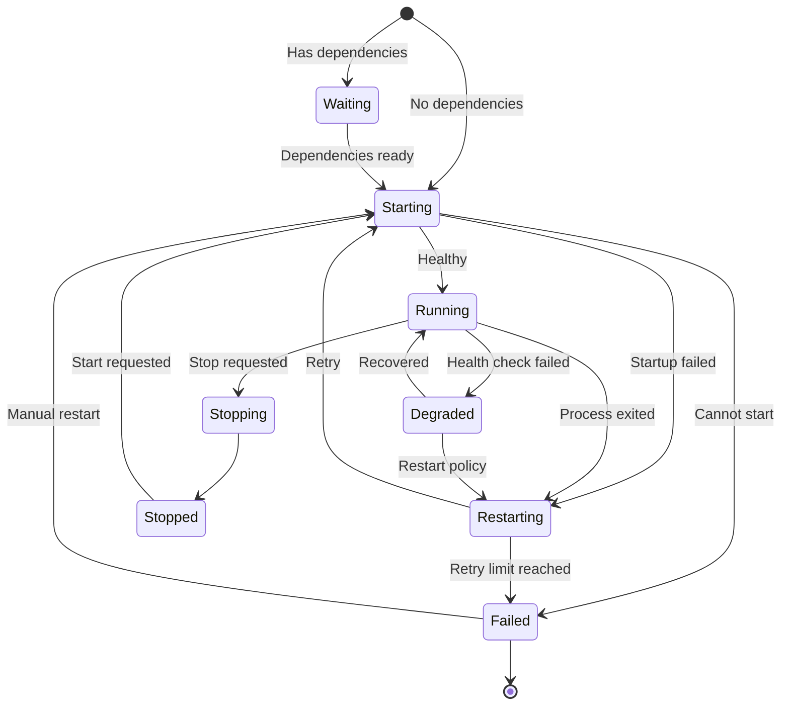

```mermaid
stateDiagram-v2
    [*] --> Waiting : Has dependencies
    [*] --> Starting : No dependencies

    Waiting --> Starting : Dependencies ready

    Starting --> Running : Healthy
    Starting --> Restarting : Startup failed
    Starting --> Failed : Cannot start

    Restarting --> Starting : Retry
    Restarting --> Failed : Retry limit reached

    Running --> Degraded : Health check failed
    Degraded --> Running : Recovered

    Running --> Restarting : Process exited
    Degraded --> Restarting : Restart policy

    Running --> Stopping : Stop requested

    Stopping --> Stopped

    Stopped --> Starting : Start requested

    Failed --> Starting : Manual restart
    Failed --> [*]
```