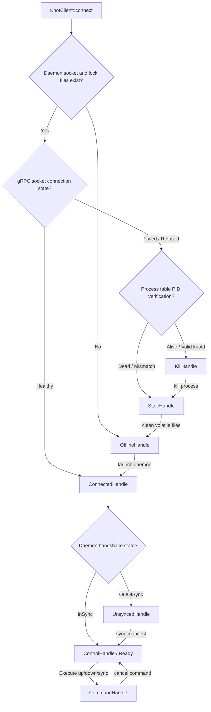

```mermaid
flowchart TD
    Client[KnotClient::connect] --> QArtifacts{Daemon socket and lock files exist?}
    QArtifacts -->|No| Offline[OfflineHandle]
    QArtifacts -->|Yes| QConnection{gRPC socket connection state?}
    QConnection -->|Healthy| Connected[ConnectedHandle]
    QConnection -->|Failed / Refused| QProcess{Process table PID verification?}
    QProcess -->|Alive / Valid knotd| Kill[KillHandle]
    QProcess -->|Dead / Mismatch| Stale[StaleHandle]

    Kill -->|kill process| Stale
    Stale -->|clean volatile files| Offline
    Offline -->|launch daemon| Connected
    Connected --> QHandshake{Daemon handshake state?}
    QHandshake -->|InSync| Control[ControlHandle / Ready]
    QHandshake -->|OutOfSync| Unsynced[UnsyncedHandle]

    Unsynced -->|sync manifest| Control
    Control -->|Execute up/down/sync| Command[CommandHandle]
    Command -->|cancel command| Control
```